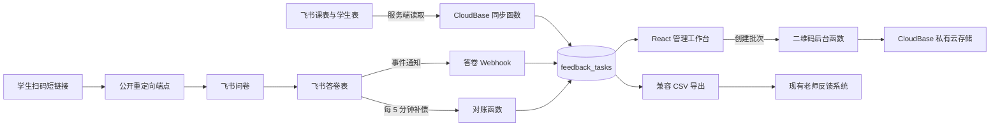

# 月度课程反馈问卷跟踪系统 — 技术设计

状态：已确认  
需求基线：[requirements.md](./requirements.md)

## 1. 设计目标

在现有菁仕教育服务 monorepo 中新增独立应用 `apps/course-feedback-tracker`，部署到腾讯云 CloudBase，不改变现有三个 Vercel Project 的部署边界。系统以飞书课表和问卷答卷为外部业务数据源，以 CloudBase 为任务状态、审计记录和批量产物的运行平台。

月度口径采用双月份：用户选择“收集月份”，系统读取上一个自然月的完整课表。例如选择 2026-09 时，任务对应 `courseMonth=2026-08`、`collectionMonth=2026-09`。

## 2. 设计规格

### DESIGN SPECIFICATION

1. **Purpose Statement**：这是给教务老师使用的月度反馈运营台，核心是快速回答“应该发多少份、发给谁、谁还没填、哪里同步失败”。界面优先保证密集数据的可扫读性、批量处理效率和异常可定位性。
2. **Aesthetic Direction**：Industrial/utilitarian。采用教务台账与编辑部排版结合的视觉语言，强调时间、批次、状态和清晰的操作层级。
3. **Color Palette**：墨黑 `#17191D`、纸白 `#F5F3EE`、学院蓝 `#173B63`、行动青 `#149EC2`、完成绿 `#2D8065`；警告和错误分别使用 `#B96E16` 与 `#BE3F3A`，仅用于状态语义。
4. **Typography**：标题使用 `Noto Serif SC`，正文使用 `Noto Sans SC`，月份、数量、任务 ID 使用 `IBM Plex Mono`。Web 字体自行托管，二维码卡片生成函数随包携带中文字体，不依赖运行时系统字体。
5. **Layout Strategy**：桌面端采用窄左侧品牌轨道、跨栏月份上下文条、错位统计带和占据主视野的横向任务台账；筛选器吸附在表头上方，任务详情和二维码从右侧抽屉展开。移动端退化为状态分组列表，不复刻桌面大表格。

### 主要界面

1. **登录页**：极简身份入口，只展示系统名称、当前环境和登录表单。
2. **月度任务台**：课程月份/收集月份、状态统计、筛选器、任务列表、批量状态、二维码批次、导出入口。
3. **同步与异常页**：课表同步批次、答卷同步批次、姓名选项差异、缺字段记录、重复答卷和重试操作。
4. **设置页**：飞书连接状态、课程排除规则、二维码卡片设置、管理员和反馈系统衔接配置；不展示任何 Secret 明文。

### 二维码卡片

- 标准尺寸 1080 × 1440，输出 PNG；批量产物为 ZIP。
- 显示课程反馈问卷、学生、老师、合并后的课程名称、课程月份、二维码和填写提示。
- 二维码编码 CloudBase 短链接，不直接编码含姓名的飞书长链接。
- 二维码保持黑白、高对比度、至少四模块静区；背景装饰不得侵入二维码区域。
- Figma 用于维护视觉组件和背景资产，运行时排版和二维码由程序生成。

## 3. 系统架构

### 模块边界

- `apps/course-feedback-tracker/web`：Vite + React + TypeScript 管理前端。
- `apps/course-feedback-tracker/functions/feedback-api`：受保护的管理 API、飞书 Webhook、公开短链接重定向。
- `apps/course-feedback-tracker/functions/feedback-sync`：课表任务生成、下拉选项补齐、答卷补偿对账。
- `apps/course-feedback-tracker/functions/feedback-qr-worker`：二维码卡片分批生成、ZIP 打包和云存储上传。
- `apps/course-feedback-tracker/src/domain`：可在函数和测试间复用的月份、过滤、分组、任务 ID、状态迁移及 URL 生成逻辑。
- `apps/course-feedback-tracker/tests`：领域单元测试、飞书适配器契约测试和导出兼容测试。

## 4. 技术选择

### 前端

- React + TypeScript + Vite。
- CloudBase Web SDK 只负责身份会话和调用受保护后端；飞书凭据永不进入浏览器。
- 默认使用 Hash Router，避免 CloudBase 静态托管直接访问子路由时出现 404；若后续改用 History Router，必须把 404 文档配置为 `index.html`。
- 图标统一使用 Phosphor Icons，不使用 Emoji 作为功能图标。

### 后端

- 管理和重定向入口使用 HTTP 云函数；Node 进程监听 9000 端口。
- 定时同步、任务生成和二维码批量生成使用 Event Function。
- 纯二维码使用 `qrcode`；卡片 PNG 采用 SVG 模板 + `sharp`，并嵌入已授权中文字体；ZIP 使用 `archiver`。
- 每个二维码批次默认 20 张一组，失败项可单独重试，避免一个长 HTTP 请求承担全部工作。

### 数据存储

- CloudBase 数据库是任务状态、同步批次、二维码批次和审计日志的主数据源。
- 飞书现有“问卷任务表”作为可选镜像，便于业务方在飞书查看；镜像失败不得阻断网站主流程，但应进入异常列表。
- 飞书课表、学生表和答卷表仍是课程与反馈事实源，网站不得回写修改课表内容。
- 二维码 PNG 和 ZIP 放入私有云存储，数据库只保存 fileID；下载时生成短期有效链接。

> 数据库实现优先使用 CloudBase 文档数据库；部署前读取测试环境资源详情。如测试环境只有 PostgreSQL，则保持同一领域模型改用 PG 表和 RLS，不在代码中同时维护两套运行实现。

## 5. 领域模型

### `feedback_tasks`

| 字段 | 说明 |
|---|---|
| `taskId` | 稳定唯一 ID；由课程月份、学生记录 ID、老师规范名生成摘要 |
| `publicTokenHash` | 短链接随机 token 的哈希；不使用可枚举 ID |
| `courseMonth` | 课程月份，例如 `2026-08` |
| `collectionMonth` | 收集月份，例如 `2026-09` |
| `studentRecordId` / `studentName` | 飞书学生关联记录和规范姓名 |
| `teacherSourceName` / `teacherFormName` | 课表姓名及问卷最终选项姓名 |
| `courseNames` | 去重后的课程名称数组 |
| `scheduleRecordIds` | 形成任务的课表记录 ID，用于审计 |
| `status` | `unsent / sent / completed / declined` |
| `submittedAt` / `responseRecordIds` | 完成时间与关联答卷 |
| `validationIssues` | 未匹配姓名、缺字段或课程规则异常 |
| `createdAt` / `updatedAt` | 创建与更新时间 |

唯一约束：`courseMonth + studentRecordId + teacherCanonicalName`。重新同步必须更新同一任务，不得重复创建。

### `sync_runs`

保存同步类型、月份范围、游标、成功/跳过/失败数量、错误摘要、开始/结束时间和触发来源。用于显示最近同步结果和幂等恢复。

### `feedback_responses`

保存飞书答卷 record ID、任务 ID、提交时间、同步状态和重复标记。评分正文仍保留在飞书，CloudBase 不额外复制不必要的敏感问卷内容。

### `qr_batches`

保存批次 ID、筛选快照、总数、完成数、失败数、状态、ZIP fileID、过期时间和错误清单。

### `audit_logs`

保存操作者、操作类型、任务 ID、旧值、新值、时间和请求关联 ID。状态自动变更和手动变更都必须记录。

## 6. 核心数据流程

### 6.1 生成月度任务

1. 用户选择收集月份 `M`，服务端计算课程月份 `M - 1`，时区固定为 `Asia/Shanghai`。
2. 分页读取课程月份内课表，同时读取关联学生记录。
3. 排除缺学生、缺老师、临时取消及已配置的非授课课程；无法判断的课程进入复核清单。
4. 按 `课程月份 + 学生记录 ID + 老师规范名` 分组，合并课程名和课表记录 ID。
5. 计算稳定任务 ID，执行幂等 upsert；保留已有手动状态。
6. 比较问卷学生/老师选项，只追加缺失规范名，不删除历史选项；再次读取字段配置确认写入成功。
7. 生成随机公共 token 和短链接，验证三项预填字段后才允许任务进入“可发送”。
8. 尝试镜像到飞书任务表，并记录主流程与镜像结果。

### 6.2 学生打开问卷

1. 二维码访问 `/t/:token`。
2. 服务端对 token 求哈希并查找有效任务，不向浏览器返回任务详情。
3. 服务端用 `URLSearchParams` 构建包含学生、老师、任务 ID 的飞书 URL。
4. 返回 `302` 跳转；可记录不含设备指纹的打开次数和最近打开时间。

### 6.3 答卷同步

1. 飞书新增答卷事件进入 Webhook；必须校验事件签名和 challenge。
2. 服务端按答卷 record ID 从飞书重新读取完整记录，不信任事件内的业务字段。
3. 只按 `任务ID` 绑定任务；无任务 ID、未知 ID 和关键字段缺失进入异常列表。
4. 将任务更新为“已填写”，记录提交时间和答卷 record ID；重复提交只追加答卷引用。
5. 每 5 分钟按游标读取新增/更新答卷，补偿 Webhook 遗漏；同一答卷重复处理结果保持一致。

### 6.4 批量二维码

1. 管理 API 创建 `qr_batches` 记录后立即返回批次 ID。
2. Worker 每次领取最多 20 个任务，生成 1080 × 1440 PNG 并上传私有存储。
3. 全部完成后生成 ZIP；部分失败时 ZIP 包含成功项及一份错误清单。
4. 页面轮询批次状态，完成后请求临时下载链接。
5. 定时任务清理过期 PNG、ZIP 和 fileID 引用。

## 7. API 设计

### 受保护的管理接口

- `GET /api/tasks?collectionMonth=&status=&teacher=&student=&course=`
- `POST /api/sync/tasks`：生成或刷新月度任务。
- `POST /api/sync/responses`：手动触发答卷对账。
- `PATCH /api/tasks/:taskId/status`：修改状态并写审计日志。
- `POST /api/qr-batches`：为筛选结果或选中任务创建二维码批次。
- `GET /api/qr-batches/:batchId`：查询进度和结果。
- `GET /api/exports/:collectionMonth/tasks.csv`
- `GET /api/exports/:collectionMonth/feedback.csv`
- `GET /api/exports/:collectionMonth/schedule.csv`

### 公开接口

- `GET /t/:token`：只执行短链接校验和 302 跳转。
- `POST /api/webhooks/feishu`：只接受通过飞书签名校验的事件。

未知路径返回 404，不支持的方法返回 405。管理接口不得以 CORS `*` 对外开放，只允许正式网站域名和本地开发地址。

## 8. 凭据与配置

### 服务端 Secret

- `FEISHU_APP_ID`
- `FEISHU_APP_SECRET`
- `PUBLIC_TOKEN_PEPPER`

这些值仅配置在 CloudBase 服务端密钥或函数环境中，不写入 `cloudbaserc.json`、前端变量、日志和 Git。当前对话中提供的飞书 Secret 应在正式上线前轮换，新值直接录入 CloudBase 控制台。

### 非敏感环境配置

- `FEISHU_SCHEDULE_APP_TOKEN`
- `FEISHU_SCHEDULE_TABLE_ID`
- `FEISHU_STUDENT_TABLE_ID`
- `FEISHU_FEEDBACK_APP_TOKEN`
- `FEISHU_RESPONSE_TABLE_ID`
- `FEISHU_TASK_TABLE_ID`
- `FEISHU_FORM_SHARE_TOKEN`
- `FEEDBACK_REPORT_URL`
- `QR_STORAGE_PREFIX`
- `COURSE_EXCLUSION_RULES`

## 9. 权限与安全

- 管理页面使用 CloudBase 内置身份认证，首版采用邮箱登录和管理员白名单。
- 只有短链接和飞书 Webhook 为公开端点；二者都不返回管理数据。
- 管理 API 每次请求校验 CloudBase 用户身份及管理员角色。
- 云存储保持私有，二维码批次通过短期链接下载。
- 公共 token 使用高熵随机值，数据库保存带 pepper 的哈希；日志不得记录完整 token、Secret、原始请求头或完整问卷内容。
- 飞书应用权限遵循最小授权：读取课表/学生/答卷、追加问卷选项、写任务镜像及订阅答卷事件。

## 10. 测试策略

- **单元测试**：自然月偏移、上海时区边界、取消/非授课过滤、分组去重、稳定任务 ID、中文 URL 编码、状态迁移、重复答卷。
- **契约测试**：以脱敏 fixture 验证飞书字段结构变化能产生明确错误，不静默返回空结果。
- **集成测试**：重复同步三次任务数不变；选项追加后重新读取确认；Webhook 和补偿对账处理同一答卷不重复计数。
- **导出兼容测试**：导出的课表与反馈 CSV 可被 `apps/teacher-feedback` 的月度处理器接受。
- **浏览器验证**：登录、选择月份、同步、筛选、状态修改、二维码扫码、批次下载和错误重试；同时检查控制台无新增错误。
- **安全验证**：前端构建产物不含 Secret；未登录访问管理接口被拒绝；无效 token 不泄露任务是否存在。

## 11. 部署与上线

1. 在 `jingshi-test-d5gp401i44a0fa7a7` 完成资源检查和测试部署。
2. 创建数据库集合/索引、私有存储路径、函数、静态托管应用和管理员认证。
3. 用户在 CloudBase 服务端录入轮换后的飞书 Secret；设置飞书事件回调地址。
4. 使用脱敏测试记录完成端到端验证，再以只读方式核对真实月份任务数量。
5. 生产环境 ID 明确后重复声明式配置，不与现有 Vercel 项目合并。
6. 上线后核对函数日志、同步游标、任务数、Webhook 成功率和二维码下载。

## 12. 已知前置条件

- 当前 CloudBase CLI 登录态已过期；在创建资源或部署前需要重新完成设备授权。
- 需要提供首位管理员邮箱。
- 需要确认测试环境实际具备文档数据库和云存储；如资源类型不同，按第 4 节的单实现原则调整。
